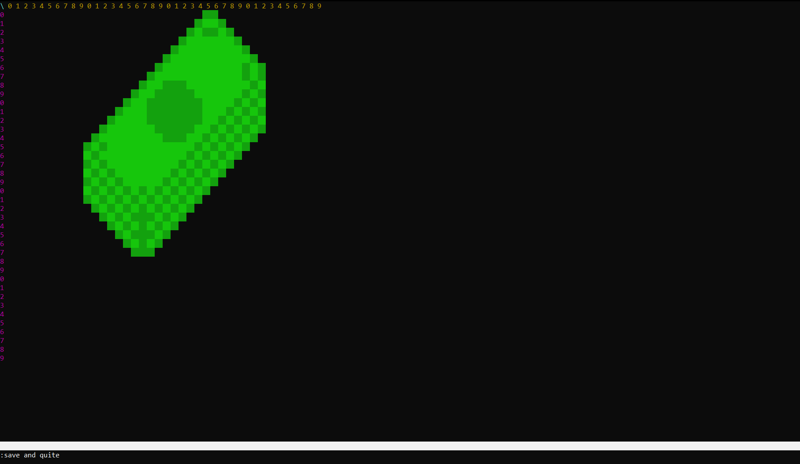
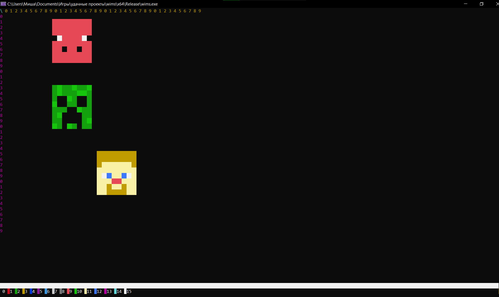

# WIMS
[](https://github.com/Ferruscpp/wims)
[](https://github.com/Ferruscpp/wims/blob/main/LICENSE)


**WIMS** — это уникальный консольный редактор изображений, работающий в текстовом интерфейсе и использующий собственный формат хранения файлов **`.wmp`**. Проект кроссплатформенный и стабильно работает как на **Linux**, так и на **Windows**.

Редактор управляется с клавиатуры и предлагает гибкую систему навигации, включая перемещение с помощью цифрового блока клавиатуры (Numpad).



---

## ✨ Основной функционал и режимы работы

В WIMS перемещение курсора доступно в любой момент с помощью стандартных **стрелочек** клавиатуры (при этом пиксели не закрашиваются). Для переключения логики работы в редакторе предусмотрено три основных режима:

### 1. 🕹 Режим перемещения (`Move`)
Предназначен для быстрой навигации по холсту без изменения содержимого.
* **WASD:** стандартное пошаговое перемещение курсора.
* **Numpad (1-9):** уникальный способ относительного позиционирования. Представьте, что клавиша `5` — это текущая позиция курсора. Нажатие цифр вокруг неё мгновенно смещает курсор в соответствующем направлении (например, `7` — по диагонали вверх-влево, `3` — по диагонали вниз-вправо).

### 2. 📝 Режим ввода текста (`Write`)
Позволяет печатать текстовые символы прямо поверх вашего изображения.
* Поддерживается ввод любых символов ASCII в диапазоне **от 32 до 126** (включая пробел, латинские буквы, цифры и базовые знаки препинания).

### 3. 🎨 Режим рисования (`Draw`)
Режим для создания графики и пиксель-арта.
* **WASD / Numpad:** при перемещении этими клавишами за курсором автоматически закрашивается след текущим цветом.
* Использование **Numpad (1-9)** в этом режиме невероятно эффективно: оно позволяет мгновенно рисовать идеальные диагональные линии («лесенки») из закрашенных пикселей за одно нажатие.

---

## 💻 Встроенная консоль команд

Для управления редактором и переключения режимов используется встроенная командная строка.

* **Открыть / Закрыть консоль:** нажмите клавишу `Esc`.
* **Активация ввода:** после открытия консоли введите символ `:` и одну из команд ниже.

### Список доступных команд

| Категория | Команда | Описание |
| :--- | :--- | :--- |
| **Режимы** | `move` | Переключиться в режим навигации Move |
| | `write` | Переключиться в режим ввода текста Write |
| | `draw` | Переключиться в режим рисования Draw |
| **Цвет** | `show_colors` / `show colors` | Отобразить палитру из 16 базовых цветов с их номерами |
| | `set_color` / `set color` | Установить текущий цвет для рисования/текста |
| **Выход и сохранение** | `s` / `save` | Сохранить текущую картинку в формат `.wmp` |
| | `q` / `quit` | Выйти из редактора без сохранения |
| | `sq` / `save&quit` / `save quit` / `save and quit` | Сохранить изменения и сразу закрыть программу |
| | `d` / `download` | Отменить несохранённые изменения и восстановить последнюю сохранённую версию изображения |

---

## 🎨 Работа с цветом

На данный момент WIMS поддерживает **16 базовых цветов**. Вы можете посмотреть их номера через команду `show colors` и применить нужный с помощью `set color`.


---

## 🛠️ Сборка и запуск

### На Linux / WSL / MacOS
Для сборки вам понадобится компилятор с поддержкой стандарта **C++17** и утилита `make`. Выполните следующие команды в терминале:

```bash
git clone https://github.com/Ferruscpp/wims
cd wims
make
sudo make install
```

### На Windows (Через любую IDE)
1. Скачайте все исходные файлы (`.h` и `.cpp`) в одну папку.
2. Создайте проект в вашей любимой IDE (например, **Visual Studio** или **CLION**).
3. Убедитесь, что в настройках проекта включен стандарт **C++17** (в Visual Studio дополнительно рекомендуется включить режим строгого соответствия `/permissive-`).
4. Соберите и запустите проект в конфигурации **Release** для максимальной производительности.
> 💡 **Совет для Windows:** Для корректного отображения всех символов ASCII и цветов рекомендуется запускать скомпилированный `.exe` файл через современный **Windows Terminal** или через **Windows PowerShell**, а не через старую командную строку `cmd.exe`.

---

## ⚙️ Аргументы командной строки (Флаги запуска)

Редактор поддерживает гибкую настройку холста при запуске через консоль. Вы можете задавать размеры, включать режим сглаживания пропорций и указывать имя файла.

### Доступные флаги:
* `-d`, `--double` — включить режим **двойного пикселя**. Позволяет компенсировать высоту строк в консоли, чтобы пиксели выглядели квадратными, а не вытянутыми.
* `-w <number>` — задать **ширину** холста (количество пикселей).
* `-h <number>` — задать **высоту** холста (количество пикселей).

### Примеры использования:

1. **Создание нового холста 40x40 с квадратными пикселями:**
   ```bash
   wims -d -w 40 -h 40 example.wmp
   ```

2. **Быстрый запуск или открытие существующего файла с настройками по умолчанию:**
   ```bash
   wims example.wmp
   ```

## 🚀 Быстрый старт (Пример работы)

Чтобы быстро освоиться в редакторе и нарисовать свой первый рисунок, выполните следующую последовательность действий:

1. **Запустите** исполняемый файл `WIMS`.
2. **Откройте встроенную консоль**, нажав клавишу `Esc`.
3. **Переключитесь в режим рисования**, введя команду `:draw` и нажав `Enter`.
4. **Установите желаемый цвет**, введя команду `:set color`.
5. **Нарисуйте ваше изображение** с помощью клавиш `WASD` и панели `Numpad` (от 1 до 9).
6. **Сохраните результат**, открыв консоль (`Esc`) и введя команду `:save`. Файл запишется в фирменном формате `.wmp`.

---

## 🚀 Планы по развитию проекта (Roadmap)
* [ ] Интеграция расширенной палитры: поддержка **8-битных цветов**.
* [ ] Реализация полноценной **RGB**-палитры для точной настройки цвета.
